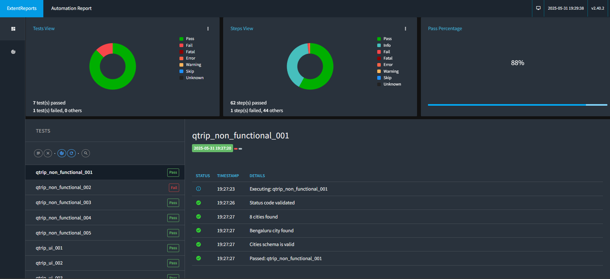

# 🛒 **Automating QTrip tours and travel Platform**  

<p align="center">
  
  
  
  
  
</p>

## 🌟 **Project Overview**  
This project automates the testing of **QTrip**, a travel booking e-commerce platform, ensuring the robustness of core functionalities like user authentication, adventure search, booking workflows by integrating API testing and UI automation.  

### Key Achievements:  
- Automated end-to-end testing using **Selenium WebDriver** for UI interactions.  
- Implemented **API testing** with **RestAssured** to validate backend services.  
- Employed **TestNG** framework for managing test suites and parallel execution.  
- Handled JSON data responses for dynamic verification of API outputs.  
- Ensured synchronization and stability of tests using implicit and explicit waits.  

---

## 🚀 **Scope of Work**  

### 🛠 **Modular Test Code and Debugging**  
- Structured modular test scripts for better readability and maintenance.  
- Debugged and fixed flaky tests related to login, search, and booking features.  
- Used IDE debugging tools with breakpoints to identify issues.  

### 🔎 **Comprehensive Test Automation**  
- Automated login/logout flows with valid and invalid credentials.  
- Verified hotel search filters and results consistency.  
- Automated booking and payment workflows, including confirmation validations.  
- Integrated API validation to cross-check UI data with backend responses.  

### ⏳ **Test Stability and Synchronization**  
- Applied **implicit** and **explicit waits** to handle dynamic page loads and AJAX calls.  
- Implemented retries and exception handling for flaky API and UI tests.  
- Captured screenshots on failures for easier troubleshooting.  

---

## 🛠️ **Skills & Technologies Used**  
- **Java** for core test scripting.  
- **Selenium WebDriver** for UI automation.  
- **RestAssured** for API testing and validation.  
- **TestNG** for organizing tests and reporting.  
- **JSON** parsing and handling API responses.  
- **Maven** or **Gradle** for dependency and build management.  
- **XPath & CSS Selectors** for robust element location.  
- **Implicit & Explicit Waits** for synchronization.  
- **GitHub Actions** (if CI is set up) for Continuous Integration.  

---

## 📸 **Snapshots of the Work**  
### **Extent report**  


---

## 📚 **How to Run the Automation**  

1. Clone the repository:  
   ```bash
   git clone https://github.com/Gourab-Pal/qtrip_api_ui.git
   cd qtrip_api_ui
   ```
2. Install dependencies and setup:  
   - Java 11+ installed and configured in your PATH  
   - Maven or Gradle installed (depending on your project setup)  
   - ChromeDriver (or relevant browser driver) available in PATH or project folder  

3. Run tests:  
   - Using Gradle:  
     ```bash
     ./gradlew clean test
     ```  
   - Or run tests from your favorite IDE using TestNG support.  

4. View reports:  
   - TestNG HTML reports will be generated under `test-output` folder after execution.  

---

## 📜 **Learn More About QTrip**  

- [📘 Project Documentation & User Guide](https://github.com/Gourab-Pal/qtrip_api_ui/wiki) _(If available)_  
- [🌐 Live Website](https://qtrip-dynamic-frontend.vercel.app/) _(QTrip demo frontend)_  

---
